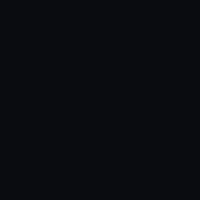

</img>

 
 

 

 ### :keyboard: Linguagens :keyboard:
 
     

 
 ### :clipboard: Minhas estatísticas :clipboard:
&nbsp;

    
    
    <a href="https://github.com/KesleyMuniz/">
        
    

 
 

